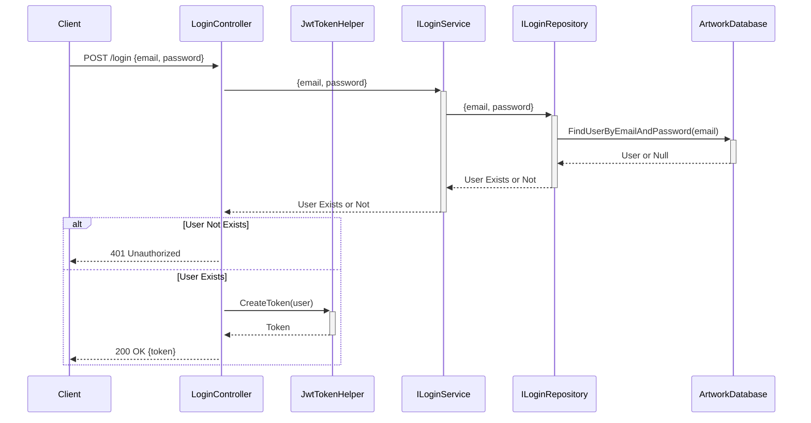

```mermaid
sequenceDiagram
   participant Client
   participant LoginController
   participant JwtTokenHelper
   participant ILoginService
   participant ILoginRepository
   participant ArtworkDatabase

   Client->>+LoginController: POST /login {email, password}
   LoginController->>+ILoginService: {email, password}
   ILoginService->>+ILoginRepository: {email, password}
   ILoginRepository->>+ArtworkDatabase: FindUserByEmailAndPassword(email)
   ArtworkDatabase-->>-ILoginRepository: User or Null
   ILoginRepository-->>-ILoginService: User Exists or Not
   ILoginService-->>-LoginController: User Exists or Not
   alt User Not Exists
      LoginController-->>Client: 401 Unauthorized
   else User Exists
      LoginController->>+JwtTokenHelper: CreateToken(user)
      JwtTokenHelper-->>-LoginController: Token
      LoginController-->>Client: 200 OK {token}
   end
```
