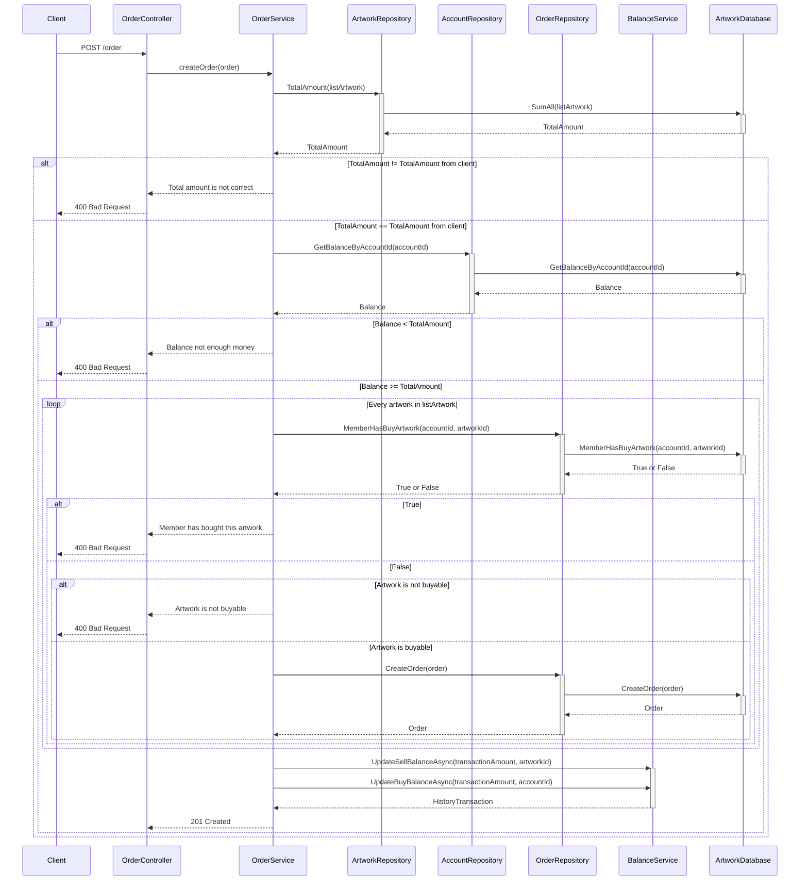

```mermaid
sequenceDiagram
      participant C as Client
      participant OC as OrderController
      participant OS as OrderService
      participant AR as ArtworkRepository
      participant ACR as AccountRepository
      participant OR as OrderRepository
      participant BS as BalanceService
      participant ArtworkDatabase

      C->>OC: POST /order
      OC->>OS: createOrder(order)
      OS->>+AR: TotalAmount(listArtwork)
      AR->>+ArtworkDatabase: SumAll(listArtwork)
      ArtworkDatabase-->>-AR: TotalAmount
      AR-->>-OS: TotalAmount
      alt TotalAmount != TotalAmount from client
            OS-->>OC: Total amount is not correct
            OC-->>C: 400 Bad Request
      else TotalAmount == TotalAmount from client
            OS->>+ACR: GetBalanceByAccountId(accountId)
            ACR->>+ArtworkDatabase: GetBalanceByAccountId(accountId)
            ArtworkDatabase-->>-ACR: Balance
            ACR-->>-OS: Balance
            alt Balance < TotalAmount
                  OS-->>OC: Balance not enough money
                  OC-->>C: 400 Bad Request
            else Balance >= TotalAmount
                  loop Every artwork in listArtwork
                        OS->>+OR: MemberHasBuyArtwork(accountId, artworkId)
                        OR->>+ArtworkDatabase: MemberHasBuyArtwork(accountId, artworkId)
                        ArtworkDatabase-->>-OR: True or False
                        OR-->>-OS: True or False
                        alt True
                              OS-->>OC: Member has bought this artwork
                              OC-->>C: 400 Bad Request
                        else False
                              alt Artwork is not buyable
                                    OS-->>OC: Artwork is not buyable
                                    OC-->>C: 400 Bad Request
                              else Artwork is buyable
                                    OS->>+OR: CreateOrder(order)
                                    OR->>+ArtworkDatabase: CreateOrder(order)
                                    ArtworkDatabase-->>-OR: Order
                                    OR-->>-OS: Order
                              end
                        end
                  end
                  OS->>+BS: UpdateSellBalanceAsync(transactionAmount, artworkId)
                  OS->>BS: UpdateBuyBalanceAsync(transactionAmount, accountId)
                  BS-->>-OS: HistoryTransaction
                  OS-->>OC: 201 Created
            end
      end
```
