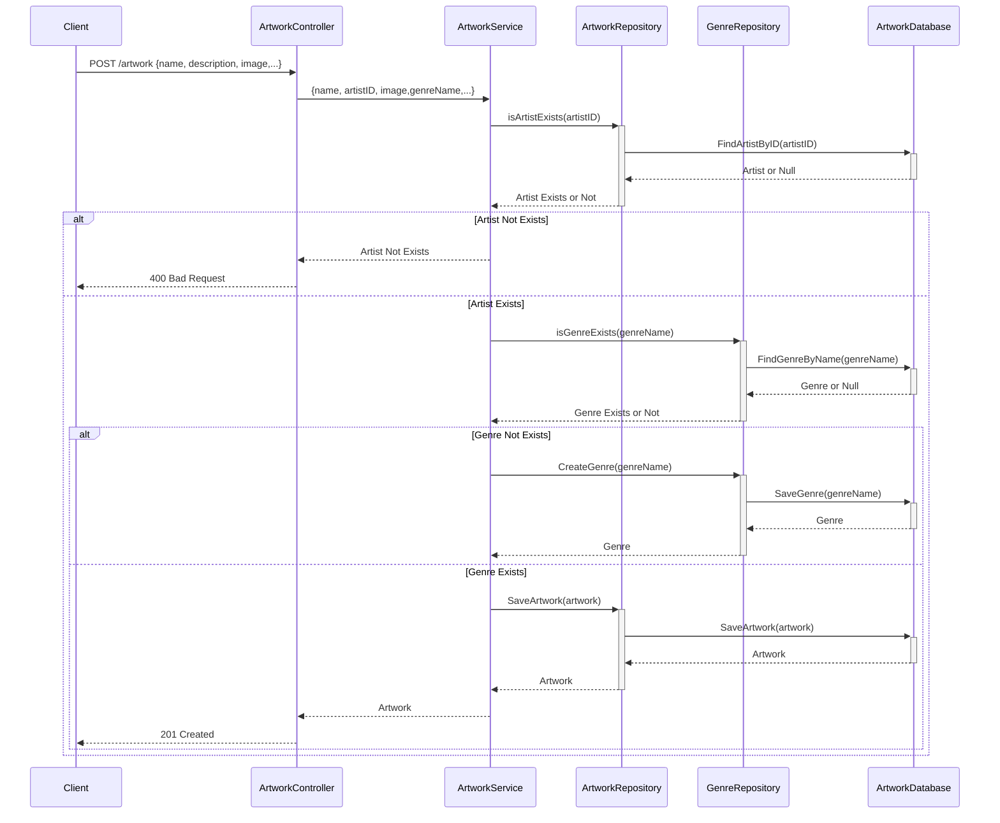

```mermaid
sequenceDiagram
   participant Client
   participant ArtworkController
   participant ArtworkService
   participant ArtworkRepository
   participant GenreRepository
   participant ArtworkDatabase

   Client->>ArtworkController: POST /artwork {name, description, image,...}
   ArtworkController->>ArtworkService: {name, artistID, image,genreName,...}
   ArtworkService->>+ArtworkRepository: isArtistExists(artistID)
   ArtworkRepository->>+ArtworkDatabase: FindArtistByID(artistID)
   ArtworkDatabase-->>-ArtworkRepository: Artist or Null
   ArtworkRepository-->>-ArtworkService: Artist Exists or Not
   alt Artist Not Exists
      ArtworkService-->>ArtworkController: Artist Not Exists
      ArtworkController-->>Client: 400 Bad Request
   else Artist Exists
      ArtworkService->>+GenreRepository: isGenreExists(genreName)
      GenreRepository->>+ArtworkDatabase: FindGenreByName(genreName)
      ArtworkDatabase-->>-GenreRepository: Genre or Null
      GenreRepository-->>-ArtworkService: Genre Exists or Not
      alt Genre Not Exists
         ArtworkService->>+GenreRepository: CreateGenre(genreName)
         GenreRepository->>+ArtworkDatabase: SaveGenre(genreName)
         ArtworkDatabase-->>-GenreRepository: Genre
         GenreRepository-->>-ArtworkService: Genre
      else Genre Exists
         ArtworkService->>+ArtworkRepository: SaveArtwork(artwork)
         ArtworkRepository->>+ArtworkDatabase: SaveArtwork(artwork)
         ArtworkDatabase-->>-ArtworkRepository: Artwork
         ArtworkRepository-->>-ArtworkService: Artwork
         ArtworkService-->>ArtworkController: Artwork
         ArtworkController-->>Client: 201 Created
      end
   end

```
