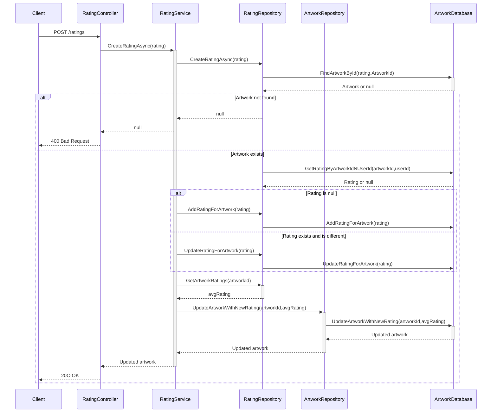

```mermaid
sequenceDiagram
    participant C as Client
    participant RC as RatingController
    participant RS as RatingService
    participant RR as RatingRepository
    participant AR as ArtworkRepository
    participant DB as ArtworkDatabase

    C->>RC: POST /ratings
    RC->>+RS: CreateRatingAsync(rating)
    RS->>RR: CreateRatingAsync(rating)
    RR->>+DB: FindArtworkById(rating.ArtworkId)
    DB-->>-RR: Artwork or null
    alt Artwork not found
        RR-->>RS: null
        RS-->>RC: null
        RC-->>C: 400 Bad Request
    else Artwork exists
        RR->>DB: GetRatingByArtworkIdNUserId(artworkId,userId)
        DB-->>RR: Rating or null
        alt Rating is null
            RS->>RR: AddRatingForArtwork(rating)
            RR->>DB: AddRatingForArtwork(rating)
        else Rating exists and is different
            RS->>RR: UpdateRatingForArtwork(rating)
            RR->>DB: UpdateRatingForArtwork(rating)
        end
        RS->>+RR: GetArtworkRatings(artworkId)
        RR-->>-RS: avgRating
        RS->>+AR: UpdateArtworkWithNewRating(artworkId,avgRating)
        AR->>+DB: UpdateArtworkWithNewRating(artworkId,avgRating)
        DB-->>-AR: Updated artwork
        AR-->>-RS: Updated artwork
        RS-->>-RC: Updated artwork
        RC-->>C: 20O OK
    end
```
