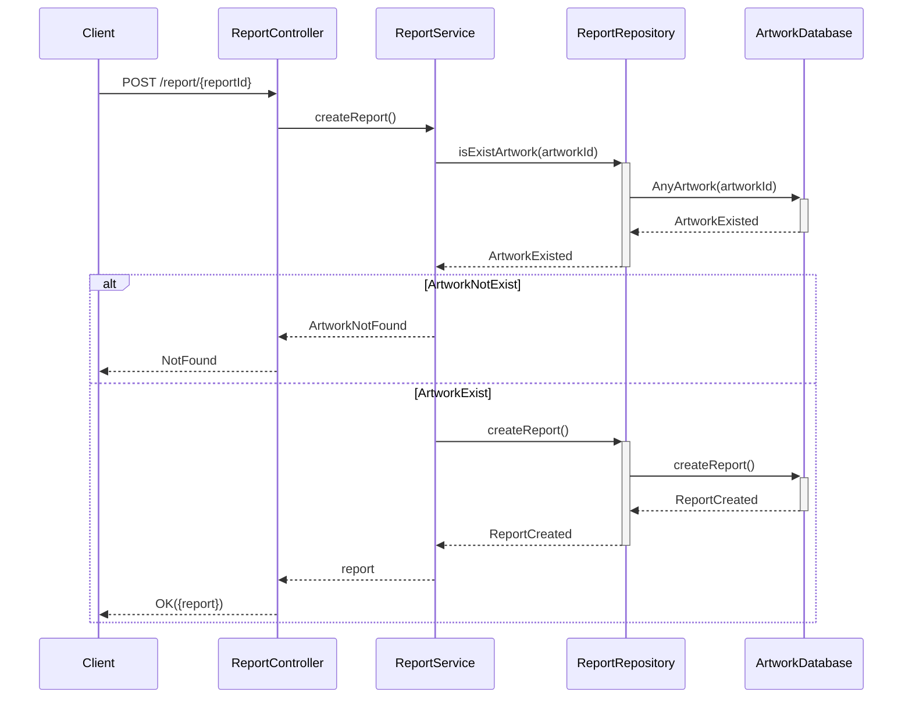

```mermaid
   sequenceDiagram
   participant C as Client
   participant RC as ReportController
   participant RS as ReportService
   participant RR as ReportRepository
   participant DB as ArtworkDatabase

   C->>RC: POST /report/{reportId}
   RC->>RS: createReport()
   RS->>+RR: isExistArtwork(artworkId)
   RR->>+DB: AnyArtwork(artworkId)
   DB-->>-RR: ArtworkExisted
   RR-->>-RS: ArtworkExisted
   alt ArtworkNotExist
       RS-->>RC: ArtworkNotFound
       RC-->>C: NotFound
   else ArtworkExist
       RS->>+RR: createReport()
       RR->>+DB: createReport()
       DB-->>-RR: ReportCreated
       RR-->>-RS: ReportCreated
       RS-->>RC: report
       RC-->>C: OK({report})
   end

```
