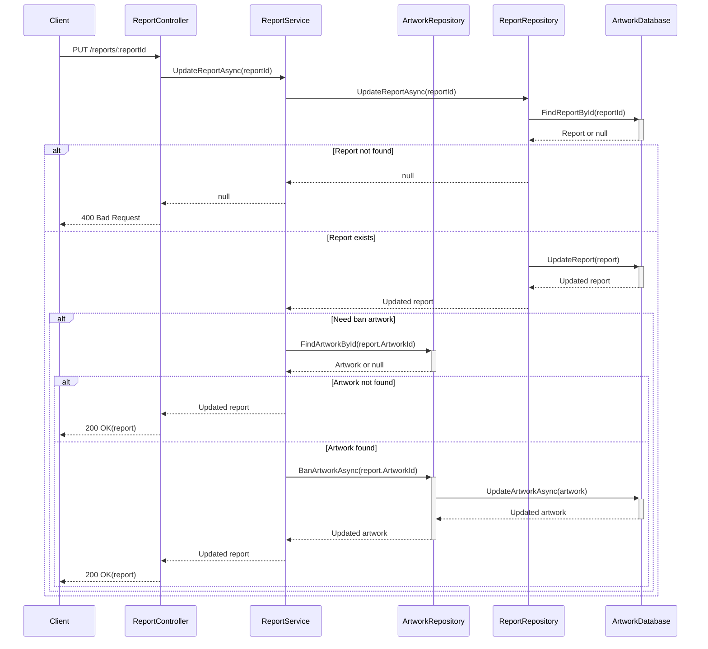

```mermaid
sequenceDiagram
   participant C as Client
   participant RC as ReportController
   participant RS as ReportService
   participant AR as ArtworkRepository
   participant RR as ReportRepository
   participant DB as ArtworkDatabase

   C->>RC: PUT /reports/:reportId
   RC->>RS: UpdateReportAsync(reportId)
   RS->>RR: UpdateReportAsync(reportId)
   RR->>+DB: FindReportById(reportId)
   DB-->>-RR: Report or null
   alt Report not found
      RR-->>RS: null
      RS-->>RC: null
      RC-->>C: 400 Bad Request
   else Report exists
      RR->>+DB: UpdateReport(report)
      DB-->>-RR: Updated report
      RR-->>RS: Updated report
      alt Need ban artwork
         RS->>+AR: FindArtworkById(report.ArtworkId)
         AR-->>-RS: Artwork or null
         alt Artwork not found
            RS-->>RC: Updated report
            RC-->>C: 200 OK(report)
         else Artwork found
            RS->>+AR: BanArtworkAsync(report.ArtworkId)
            AR->>+DB: UpdateArtworkAsync(artwork)
            DB-->>-AR: Updated artwork
            AR-->>-RS: Updated artwork
            RS-->>RC: Updated report
            RC-->>C: 200 OK(report)
         end
      end
   end
```
